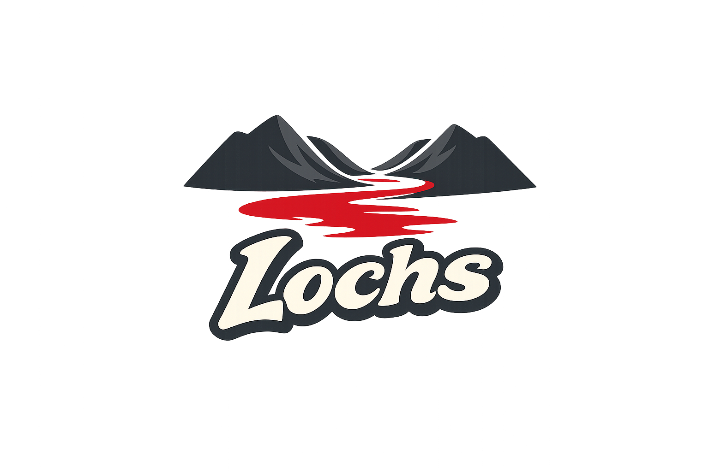

<div align="center">



# BSDulator + Lochs

**FreeBSD containers, everywhere.**

Run FreeBSD jails on Linux with Docker-like simplicity.

[](LICENSE)
[]()
[]()
[](https://lochs.dev)
[](https://discord.gg/km3VGfUW)

</div>

---

## Install

```bash
curl -fsSL https://lochs.dev/install.sh | sudo bash
```

This installs the BSDulator engine, the Lochs CLI, and fetches the FreeBSD 15.0-RELEASE base system.

## Quick Start

```bash
# Create and run a jail
$ lochs run --name webserver --vnet -p 8080:80 freebsd:15
  Jail "webserver" created (JID 1) - 10.0.0.10

# Execute into the jail
$ lochs exec webserver /bin/sh
root@webserver:/ # pkg install nginx

# List running jails
$ lochs ps
JID  NAME        IP           STATUS
1    webserver   10.0.0.10    running

# Stop and remove
$ lochs stop webserver
$ lochs rm webserver
```

## What Is This?

**BSDulator** is a FreeBSD binary compatibility layer for Linux. It intercepts FreeBSD system calls via ptrace and translates them to Linux equivalents in real time — no VMs, no emulation overhead. Think Wine for FreeBSD, or the inverse of FreeBSD's Linuxulator.

**Lochs** (pronounced "locks", like the Scottish lakes) is a Docker-like CLI built on top of BSDulator. It provides familiar container management commands (`run`, `exec`, `ps`, `stop`) for FreeBSD jails running on Linux.

Together, they bring FreeBSD's jail isolation system — the original container technology (2000, 13 years before Docker) — to any Linux host.

## Features

### BSDulator Engine
- **222 syscalls** translated or emulated ([full matrix](docs/syscalls.md))
- **Static and dynamic** FreeBSD binary support
- **FreeBSD jail syscalls** — `jail`, `jail_get`, `jail_set`, `jail_attach`, `jail_remove`
- **VNET** — full network stack isolation via Linux network namespaces
- **Bridge networking** — automatic inter-jail and host-to-jail communication
- **ABI translation** — flags, structures, errno, signals, sockaddr
- **TLS emulation** — full Thread Local Storage for FreeBSD binaries
- **Path translation** — FreeBSD system paths redirected to local root

### Lochs CLI
- **Docker-like commands** — `pull`, `run`, `exec`, `stop`, `rm`, `ps`
- **Lochfile** — Dockerfile equivalent for building custom jail images
- **lochs.yml** — Compose files for multi-service deployments
- **Image registry** — Pull from FreeBSD mirrors or custom registries
- **Port forwarding** — `-p 8080:80` maps host ports to jail ports
- **Network management** — `lochs network create/rm/ls`

### Network Architecture

```
Host System
+---------------------------------------------------------+
|                                                         |
|   bsdjail0 (bridge)                                     |
|   10.0.0.1/24                                           |
|      |                                                  |
|      +-- veth0_j1 <------> eth0 (jail1 netns)           |
|      |                      10.0.0.10/24                |
|      |                                                  |
|      +-- veth0_j2 <------> eth0 (jail2 netns)           |
|                             10.0.0.20/24                |
|                                                         |
+---------------------------------------------------------+
```

## Building from Source

```bash
git clone https://github.com/dyber-pqc/bsdulator.git
cd bsdulator

# Install dependencies (Ubuntu/Debian)
sudo apt-get install -y build-essential iproute2 wget

# Build
make

# Download FreeBSD base system (~180 MB)
./scripts/setup_freebsd_root.sh

# Verify
./bsdulator ./freebsd-root/libexec/ld-elf.so.1 ./freebsd-root/bin/echo "Hello from FreeBSD!"
```

See [docs/INSTALL.md](docs/INSTALL.md) for platform-specific instructions (Fedora, Arch, Alpine, WSL2, Docker).

## BSDulator Direct Usage

For low-level access without the Lochs CLI:

```bash
# Static binaries
./bsdulator ./freebsd-root/rescue/echo "Hello"
./bsdulator ./freebsd-root/rescue/ls /

# Dynamic binaries (via FreeBSD dynamic linker)
./bsdulator ./freebsd-root/libexec/ld-elf.so.1 ./freebsd-root/bin/sh

# Create a jail directly
sudo ./bsdulator ./freebsd-root/libexec/ld-elf.so.1 \
    ./freebsd-root/usr/sbin/jail -c name=test path=./freebsd-root ip4.addr=10.0.0.10 vnet persist

# List jails
./bsdulator ./freebsd-root/libexec/ld-elf.so.1 ./freebsd-root/usr/sbin/jls jid name ip4.addr path

# Execute in jail
sudo ./bsdulator ./freebsd-root/libexec/ld-elf.so.1 \
    ./freebsd-root/usr/sbin/jexec 1 /bin/sh -c "whoami; pwd; ls /"

# Remove jail
./bsdulator ./freebsd-root/libexec/ld-elf.so.1 ./freebsd-root/usr/sbin/jail -r 1
```

```
Usage: bsdulator [options] <freebsd-binary> [args...]

Options:
  -h, --help           Show help message
  -V, --version        Show version
  -v, --verbose        Increase verbosity (can be repeated)
  -q, --quiet          Quiet mode (errors only)
  -r, --root <path>    FreeBSD root filesystem path
  -s, --stats          Print syscall statistics on exit
  -t, --trace          Trace all syscalls (very verbose)

Environment:
  BSDULATOR_ROOT       FreeBSD root filesystem (default: ./freebsd-root)
  BSDULATOR_DEBUG      Debug level (0-4)
```

## Syscall Support

| Category | Examples | Status |
|----------|----------|--------|
| Process | fork, exec, wait, exit, kill, getpid | Full |
| File I/O | open, read, write, close, stat, fstat | Full |
| Memory | mmap, mprotect, munmap, brk | Full |
| Network | socket, bind, connect, send, recv | Full |
| Time | gettimeofday, clock_gettime, nanosleep | Full |
| Signals | sigaction, sigprocmask, sigfastblock | Full |
| IPC | semget, msgget, shmget | Full |
| *at syscalls | openat, fstatat, unlinkat | Full |
| Threading | thr_self, thr_exit, thr_kill, _umtx_op | Emulated |
| sysctl | __sysctl, __sysctlbyname | Emulated |
| Jail | jail, jail_get, jail_set, jail_attach, jail_remove | Full |
| kqueue | kqueue, kevent | Basic |
| Capsicum | cap_enter, cap_getmode | Stub |

222 total syscalls. See [docs/syscalls.md](docs/syscalls.md) for the complete matrix.

## System Requirements

| Requirement | Details |
|-------------|---------|
| **OS** | Linux (kernel 3.8+) |
| **Architecture** | x86_64 only |
| **Privileges** | Root/sudo for jail and networking features |
| **Packages** | `iproute2` (for networking) |
| **Tested On** | Ubuntu 24.04, WSL2, Debian 12, Fedora 39 |

## Project Structure

```
bsdulator/
+-- src/
|   +-- main.c                 # Entry point and CLI
|   +-- interceptor/           # ptrace syscall interception, TLS setup
|   +-- syscall/               # FreeBSD -> Linux syscall mapping
|   +-- loader/                # FreeBSD ELF detection
|   +-- abi/                   # Flags/struct translation
|   +-- runtime/               # FreeBSD runtime environment, sysctl
|   +-- jail/                  # Jail syscalls, VNET, namespaces
|   +-- lochs/                 # Lochs CLI implementation
+-- include/bsdulator/         # Headers
+-- scripts/                   # Setup and compatibility scripts
+-- examples/                  # Lochfile, lochs.yml, test files
+-- docs/                      # Documentation
+-- Makefile
+-- Dockerfile
```

## Roadmap

### Completed
- [x] 222 FreeBSD syscall translations
- [x] Static and dynamic binary support
- [x] FreeBSD shell with pipes and redirects
- [x] Full jail lifecycle (create, list, exec, remove)
- [x] VNET with bridge networking
- [x] Lochs CLI with Lochfile and compose support

### In Progress
- [ ] NAT/masquerade for external jail connectivity
- [ ] Resource limit enforcement (CPU, memory via rctl)
- [ ] Lochs image registry
- [ ] `lochs.dev/install.sh` one-line installer

### Planned
- [ ] Web dashboard
- [ ] macOS support via Hypervisor.framework VM
- [ ] Windows native support via Hyper-V
- [ ] GPU passthrough for ML workloads

## Documentation

| Document | Description |
|----------|-------------|
| [Quick Start](docs/quickstart.md) | 5-minute getting started guide |
| [Installation](docs/INSTALL.md) | Platform-specific install instructions |
| [Syscall Matrix](docs/syscalls.md) | Complete syscall support reference |
| [Architecture](docs/architecture.md) | How BSDulator works under the hood |
| [Lochs Guide](LOCHS.md) | Full Lochs CLI documentation |
| [Contributing](CONTRIBUTING.md) | How to contribute |
| [Changelog](CHANGELOG.md) | Release history |

## Community

- **Website**: [lochs.dev](https://lochs.dev)
- **Discord**: [Join the server](https://discord.gg/km3VGfUW)
- **Community Hub**: [dyber.org/community](https://www.dyber.org/community)
- **GitHub Discussions**: [Ask questions](https://github.com/dyber-pqc/bsdulator/discussions)
- **Commercial Support**: support@dyber.org

## Contributing

Contributions welcome! See [CONTRIBUTING.md](CONTRIBUTING.md) for guidelines.

Priority areas:
1. NAT/masquerade for external jail connectivity
2. Resource limit enforcement
3. Additional syscall translations
4. Test coverage

## License

Source Available License - See [LICENSE](LICENSE) for details.

Source code is available for viewing, modification, and non-commercial use. Commercial use requires a separate license. Contact support@dyber.org.

## Acknowledgments

- FreeBSD Project for jail architecture and documentation
- Linux kernel developers for ptrace and namespace infrastructure
- The Wine project for inspiration on compatibility layers

---

<div align="center">

Built by [Dyber](https://github.com/dyber-pqc) | [lochs.dev](https://lochs.dev)

</div>
